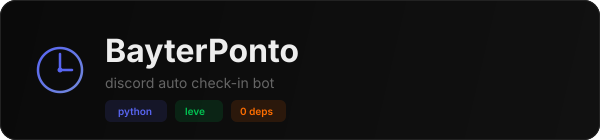
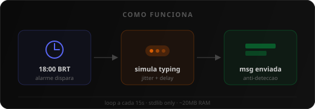
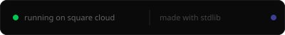

<p align="center">
  
</p>

<p align="center">
  
  
  
  
</p>

---

Bot leve que envia mensagem de ponto em um canal do Discord no horário programado. Roda 24/7 no Square Cloud usando **zero dependências externas** — apenas stdlib do Python.

<br/>

<p align="center">
  
</p>

## Funcionalidades

- Envio automático no horário configurado (padrão 18:00 BRT)
- Anti-detecção: headers reais do Chrome, cookies simulados, typing indicators, nonce snowflake
- Jitter aleatório entre 3-25s pra parecer humano
- Múltiplos alarmes via variável de ambiente
- ~20MB de RAM — cabe no plano gratuito

## Setup

**1.** Clone o repo

```
git clone https://github.com/paivaxqz/bayterponto-bot.git
```

**2.** Configure as variáveis de ambiente no Square Cloud:

| Variável | Descrição |
|---|---|
| `DISCORD_TOKEN` | Token da conta Discord |
| `DISCORD_CHANNEL_ID` | ID do canal de destino |
| `SCHEDULES` | *(opcional)* JSON com alarmes customizados |

**3.** Suba o zip no [Square Cloud Dashboard](https://squarecloud.app/dashboard)

## Alarmes customizados

Por padrão o bot envia às 18:00. Pra configurar outros horários, defina a env `SCHEDULES`:

```json
[
  {"h": 18, "m": 0, "msg": "**ENTRADA: 18h **\n**PAUSA:  **\n**SAIDA: 00:00**", "on": true},
  {"h": 12, "m": 30, "msg": "**ALMOCO**", "on": true}
]
```

## Estrutura

```
├── main.py             # bot principal (~90 linhas)
├── squarecloud.app     # config do Square Cloud
├── requirements.txt    # vazio (zero deps)
└── .github/assets/     # SVGs do README
```

## Painel Web

O painel de controle roda separado no Vercel — permite testar a conexão e fazer envios manuais.

---

<p align="center">
  
</p>
